# 🚀 AWS Capstone Project 2  
## High Availability PHP Web Application with Elastic Beanstalk & Multi-AZ RDS

---

## 📌 Project Overview

This project demonstrates the deployment of a highly available and scalable PHP-based web application using **AWS Elastic Beanstalk**, integrated with an external **Amazon RDS (MySQL) Multi-AZ database**.

The architecture leverages Elastic Beanstalk’s managed environment to automate:

- Application deployment
- Load balancing
- Auto scaling
- Health monitoring

The database tier is decoupled from the application tier to ensure **data persistence, fault tolerance, and seamless environment updates**.

---

## 🏗️ Architecture Diagram

---

## 🎯 Objective

To deploy a fault-tolerant, auto-scalable, and maintainable PHP web application using:

- AWS Elastic Beanstalk
- External Amazon RDS (Multi-AZ)
- Secure security group configuration
- Managed Auto Scaling & Load Balancing

Ensuring high availability, performance, and minimal downtime.

---

## 🛠️ AWS Services Used

- AWS Elastic Beanstalk (PHP Platform)
- Amazon EC2 (Managed by EB)
- Application Load Balancer
- Auto Scaling Group
- Amazon RDS (MySQL – Multi-AZ)
- VPC
- Security Groups

---

# ⚙️ Implementation Steps

---

## 1️⃣ Created RDS Database (Multi-AZ)

- DB Instance Name: `ebdb`
- Engine: MySQL
- Multi-AZ Deployment Enabled

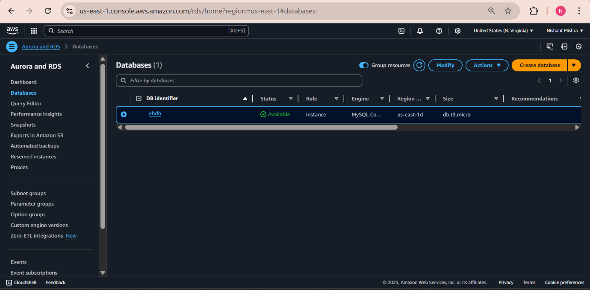

---

## 2️⃣ Verified Multi-AZ Configuration

Multi-AZ ensures automatic failover in case of primary DB failure.

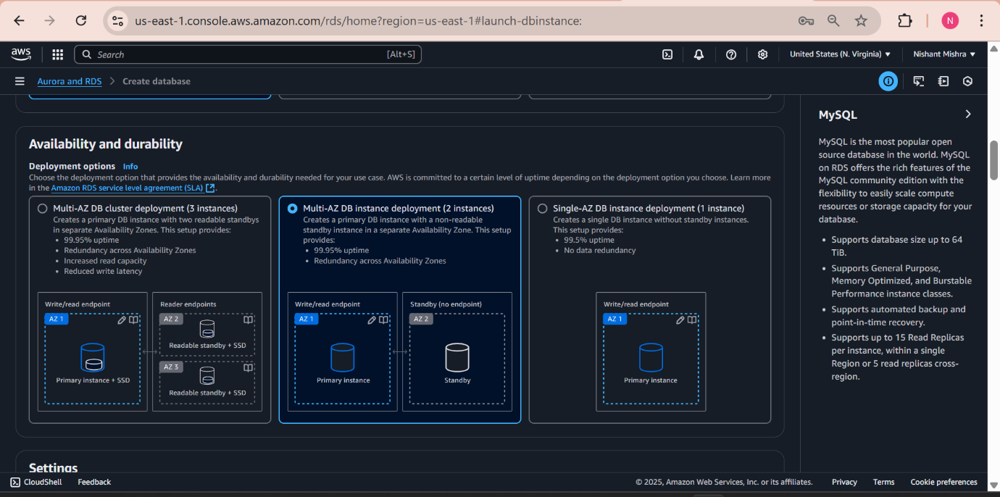

---

## 3️⃣ Configured RDS Security Group (Ingress Rules)

Modified inbound rules to allow MySQL (3306) access only from Elastic Beanstalk EC2 security group.

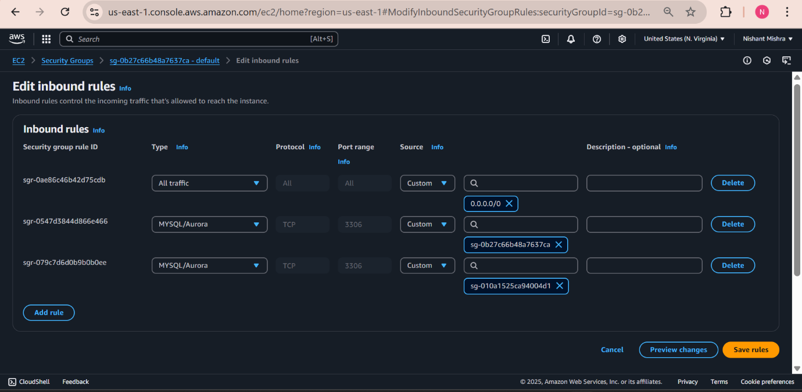

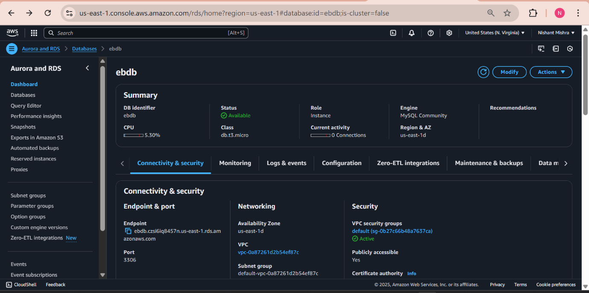

---

## 4️⃣ Created Elastic Beanstalk Environment (PHP Platform)

- Environment Type: Load Balanced
- Platform: PHP
- Managed by Elastic Beanstalk

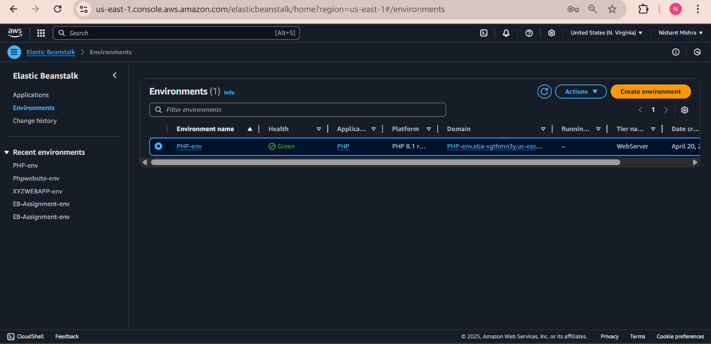

---

## 5️⃣ Attached DB Security Group to Elastic Beanstalk Security Group

Ensured secure communication between application tier and database tier.

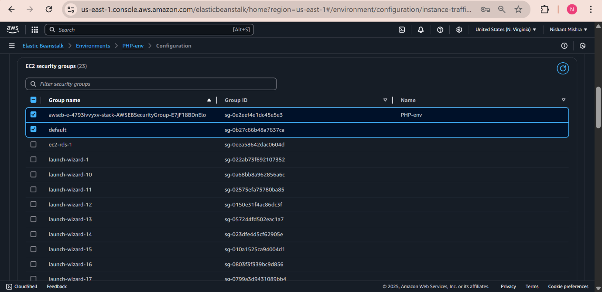

---

## 6️⃣ Configured Environment Properties

- Set RDS endpoint
- Configured database credentials
- Linked external RDS

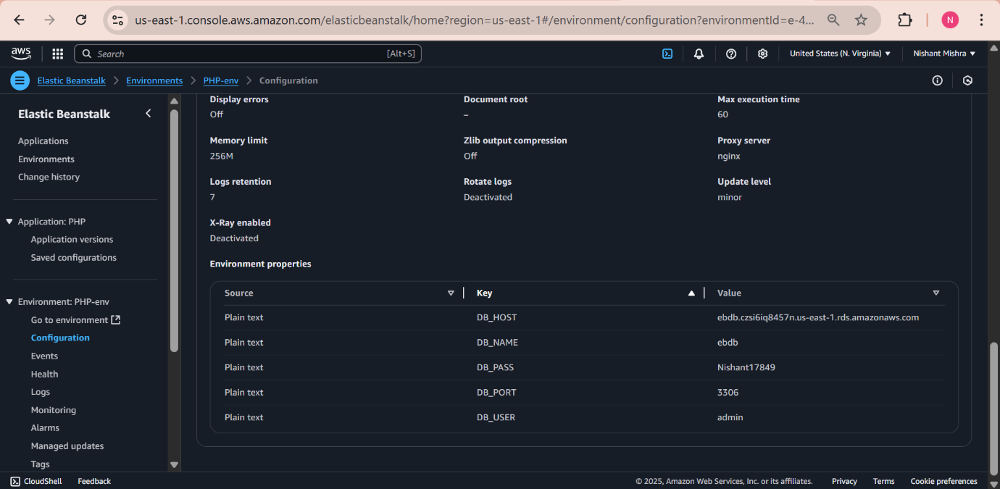

---

## 7️⃣ Configured Auto Scaling (High Availability)

- Minimum Instances: 2
- Elastic Beanstalk managed Auto Scaling Group
- Load Balancer enabled

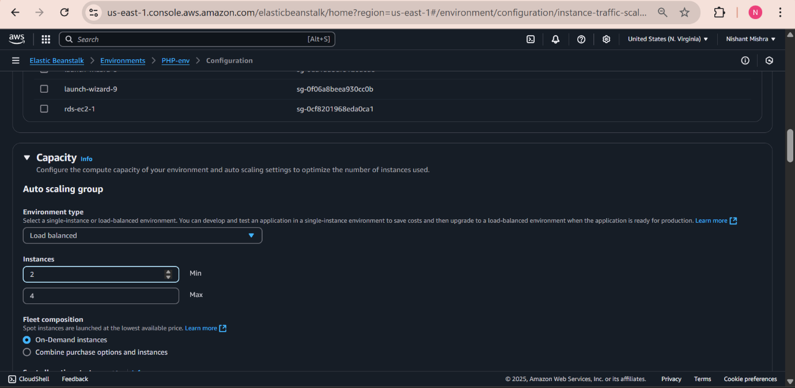

---

## 8️⃣ Deployed Sample PHP Website

Application successfully deployed and accessible via Elastic Beanstalk URL.

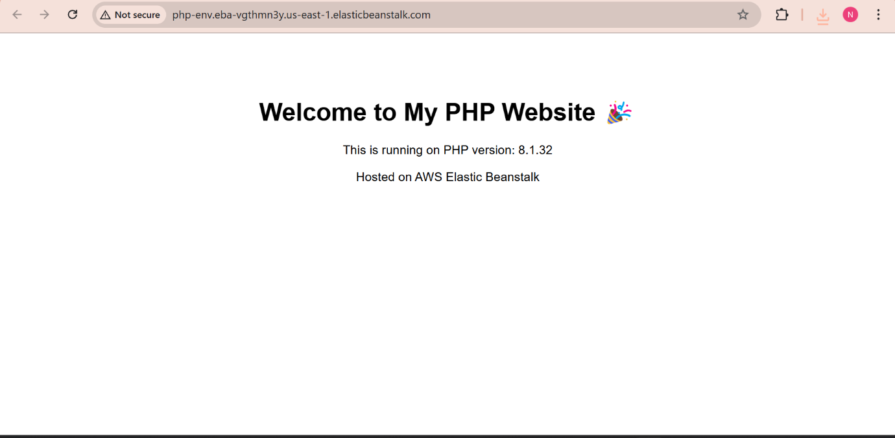

---

## 9️⃣ Environment Cleanup

Deleted Elastic Beanstalk environment after testing to avoid unnecessary charges.

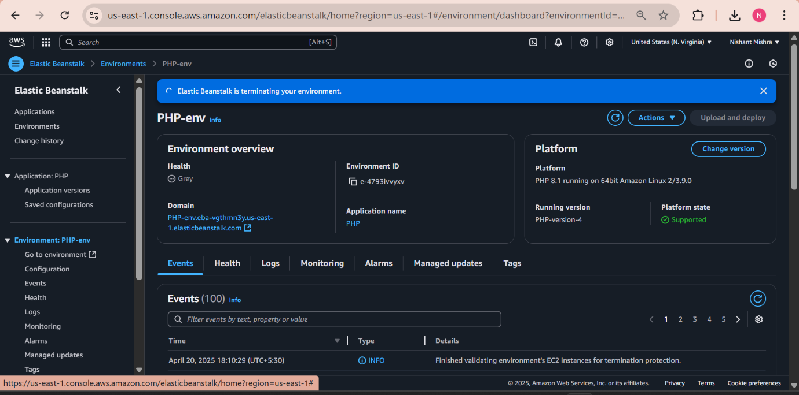

---

## 🔟 RDS Cleanup

Deleted the RDS instance after project completion.

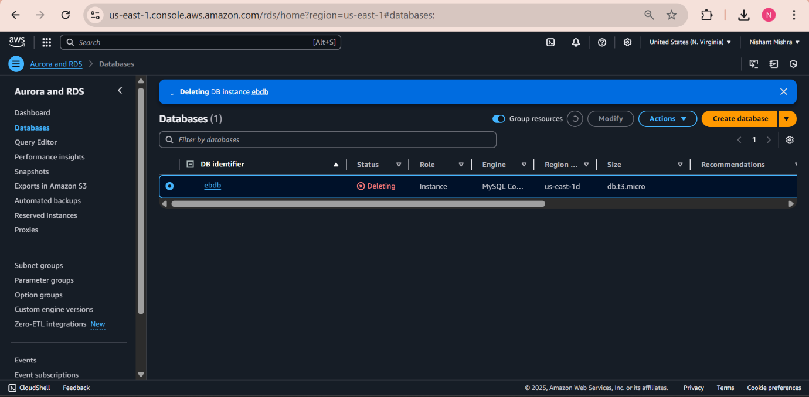

---

# 🔐 Security Implementation

- RDS placed in private subnets
- Inbound MySQL access restricted to Elastic Beanstalk EC2 security group only
- Public HTTP access routed through Application Load Balancer
- Decoupled database architecture for security and persistence

---

# 📈 Key Features

✔ Managed Deployment using Elastic Beanstalk  
✔ Multi-AZ RDS for Fault Tolerance  
✔ Decoupled Application & Database Tiers  
✔ Auto Scaling for High Availability  
✔ Load Balanced Architecture  
✔ Secure Security Group Configuration  
✔ Cost Optimization (Resource Cleanup)

---

## ⚠️ Project Status

The infrastructure was successfully deployed and tested in AWS.  
All Elastic Beanstalk environments and RDS instances were deleted after completion to prevent unnecessary AWS charges.

---

## 👨‍💻 Author

Nishant Mishra  
Cloud & DevOps Enthusiast
