# 🌐 AWS Multi-VPC Peering Architecture  
## Production & Development Network Design

---

## 📌 Project Overview

This project demonstrates the design and implementation of two isolated Amazon VPC environments — **Production** and **Development** — with controlled internet access, multi-tier architecture, and secure VPC peering communication.

The objective was to simulate a real enterprise expansion scenario where separate environments are required while maintaining secure cross-VPC connectivity.

---

# 🏗 Architecture Summary

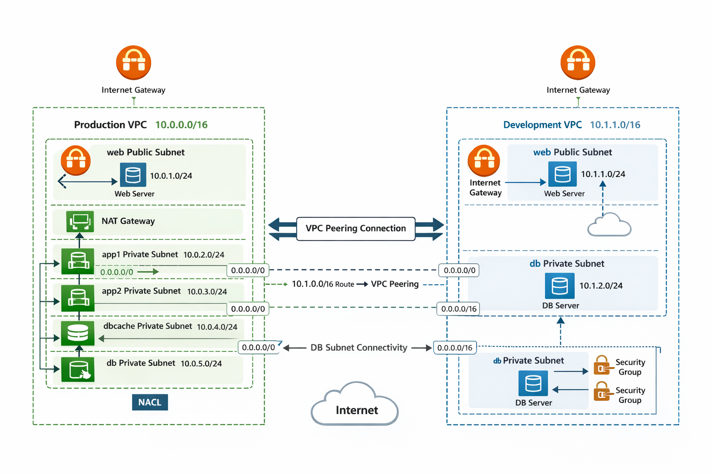

---

# 🏢 Production VPC

**CIDR Block:** `10.0.0.0/16`  
**Architecture Type:** 4-Tier  

### Subnets Created

| Subnet | Type | CIDR |
|--------|------|------|
| web | Public | 10.0.1.0/24 |
| app1 | Private | 10.0.2.0/24 |
| app2 | Private | 10.0.3.0/24 |
| dbcache | Private | 10.0.4.0/24 |
| db | Private | 10.0.5.0/24 |

### Configuration Details

- Internet Gateway attached to VPC
- 1 NAT Gateway deployed in public subnet
- EC2 instances launched in all subnets
- Custom NACL created and attached
- Security Groups configured

### Internet Access Rules

- `app1` → Allowed internet access via NAT
- `dbcache` → Allowed internet access via NAT
- `app2` → No internet access
- `db` → No internet access

This ensures selective outbound traffic control.

---

# 🧪 Development VPC

**CIDR Block:** `10.1.0.0/16`  
**Architecture Type:** 2-Tier  

### Subnets Created

| Subnet | Type | CIDR |
|--------|------|------|
| web | Public | 10.1.1.0/24 |
| db | Private | 10.1.2.0/24 |

### Configuration Details

- Internet Gateway attached
- EC2 instances launched in both subnets
- Only `web` subnet allowed internet access
- `db` subnet isolated (no internet route)

---

# 🔗 VPC Peering Configuration

A VPC Peering connection was established between:

- Production VPC (`10.0.0.0/16`)
- Development VPC (`10.1.0.0/16`)

### Route Table Updates

**Production Route Table**
```
10.1.0.0/16 → VPC Peering Connection
```

**Development Route Table**
```
10.0.0.0/16 → VPC Peering Connection
```

This enabled secure communication between the DB subnets of both environments.

---

# 🔐 Security Implementation

- Security Groups configured for subnet-level access
- Network ACL created and attached in Production VPC
- Controlled outbound internet routing
- Private DB subnet communication across VPCs
- Non-overlapping CIDR blocks used

---

# 📸 Implementation Screenshots

## VPC Creation
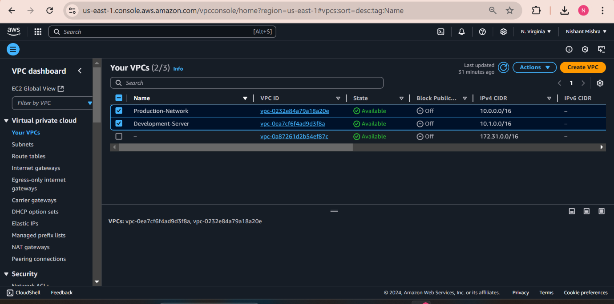

## Production Subnets
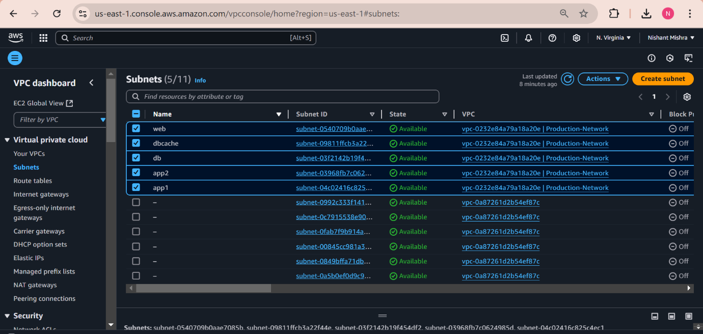

## Production Instances
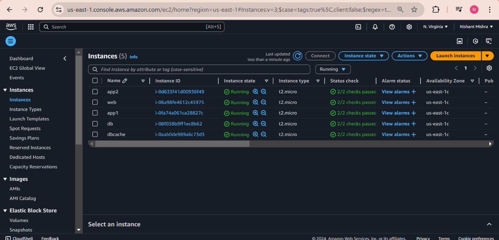

## NAT Gateway
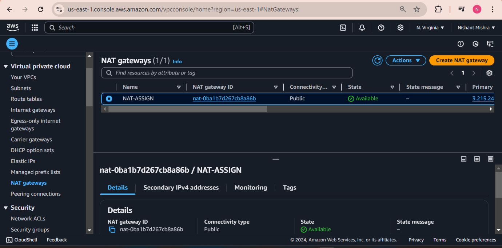

## NAT Resource Map
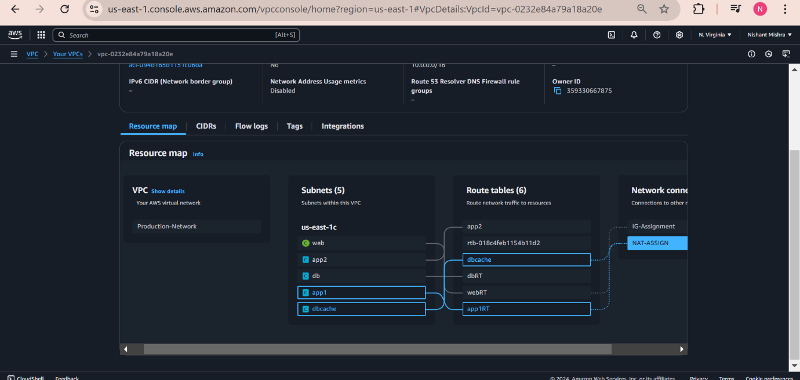

## Production NACL
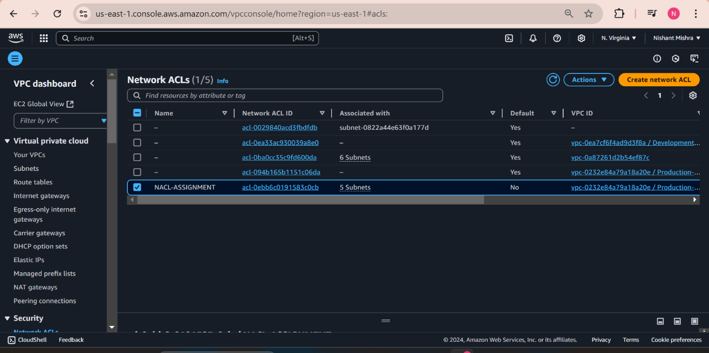

## Development Subnets
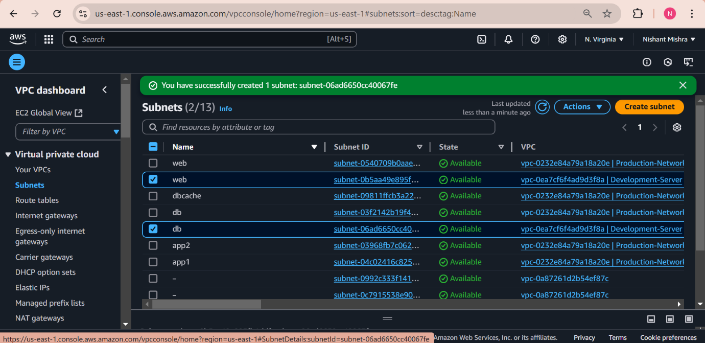

## Development Instances
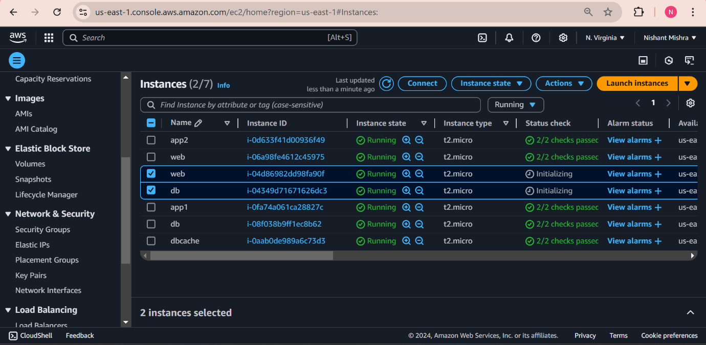

## VPC Peering Request
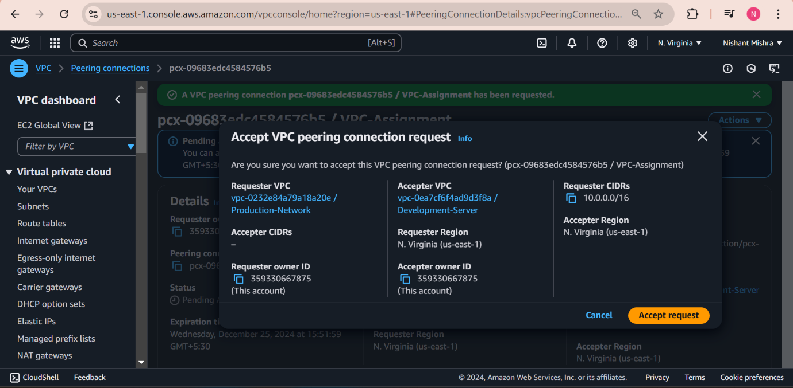

## VPC Peering Accepted
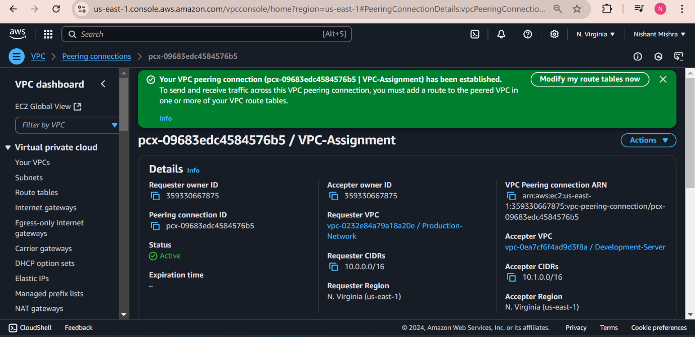

## Production Route Table
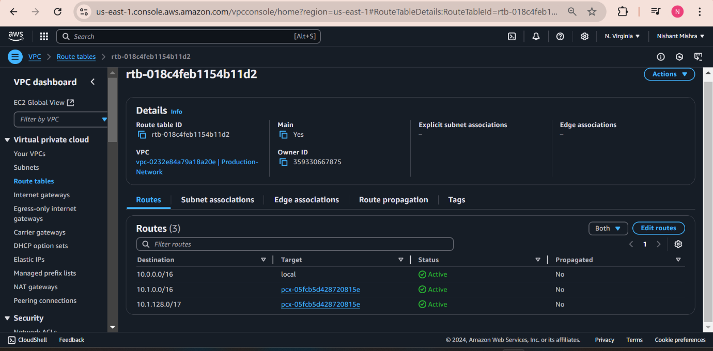

## Development Route Table
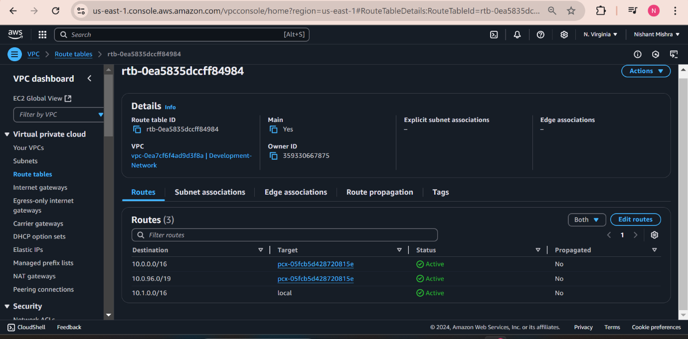

---

# 🎯 Key Learning Outcomes

✔ Multi-tier VPC architecture design  
✔ Public vs Private subnet implementation  
✔ NAT Gateway configuration  
✔ Controlled internet routing  
✔ VPC Peering setup  
✔ Route table modification  
✔ Cross-VPC DB communication  
✔ Security Group & NACL management  
✔ Environment isolation strategy  

---

# 🧹 Cleanup

All resources were deleted after testing to avoid unnecessary AWS charges.

---

## 👨‍💻 Author

Nishant Mishra  

