# 🚀 DevOps Capstone Project 2  
## Terraform + Ansible + Jenkins + Docker + Kubernetes

---

# 📌 Project Overview

This project demonstrates a complete DevOps lifecycle implementation including:

- Infrastructure provisioning using Terraform
- Configuration management using Ansible
- CI/CD automation using Jenkins
- Docker image build and push to DockerHub
- Kubernetes cluster deployment with 2 replicas
- NodePort service exposure on port 30008

Application Repository Used:
https://github.com/hshar/website.git

---

# 🏗 Architecture Diagram

## 🔹 High-Level CI/CD Flow

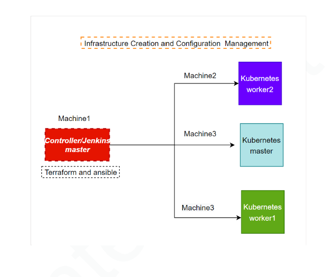

## 🔹 Infrastructure & Configuration Flow

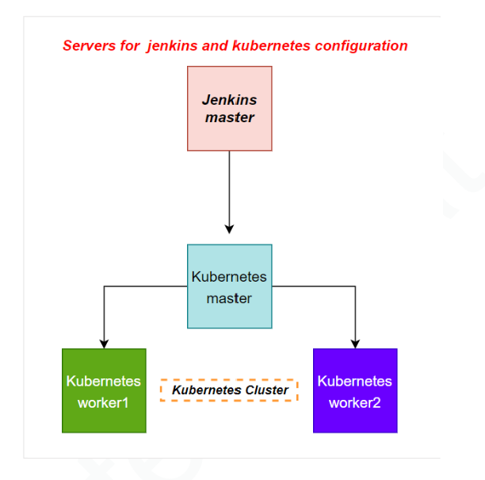

---

# 🏗 Infrastructure Provisioning – Terraform

Terraform was used to create the required EC2 infrastructure:

- Controller Machine (Terraform + Ansible + Jenkins)
- Kubernetes Master Node
- Kubernetes Worker Node 1
- Kubernetes Worker Node 2

## Terraform Commands Used

```bash
terraform init
terraform validate
terraform plan
terraform apply
```

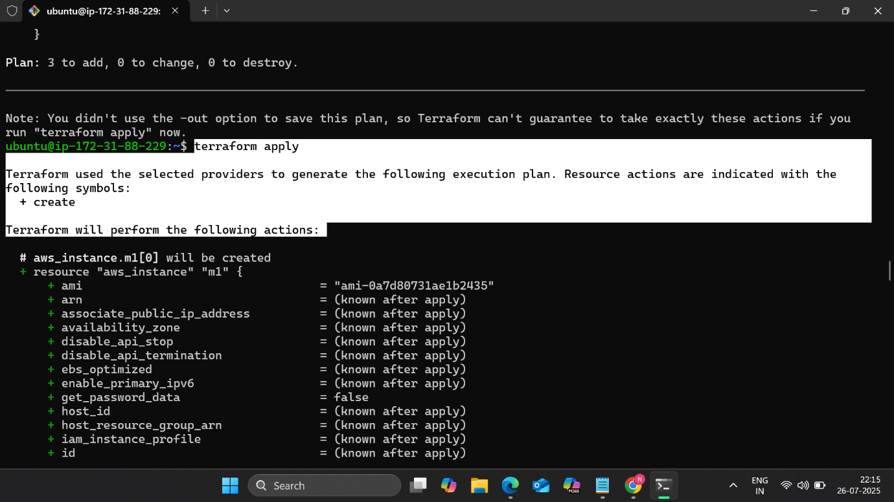


---

# ⚙ Configuration Management – Ansible

Ansible was used to automate software installation and configuration across all machines.

### Controller Machine:
- Jenkins
- Java
- Ansible

### Kubernetes Nodes:
- Docker
- Kubernetes
- Java (where required)

## Ansible Files Used

- `inventory`
- `book.yml`
- `master.sh`
- `slaves.sh`

```bash
ansible-playbook -i inventory book.yml
```

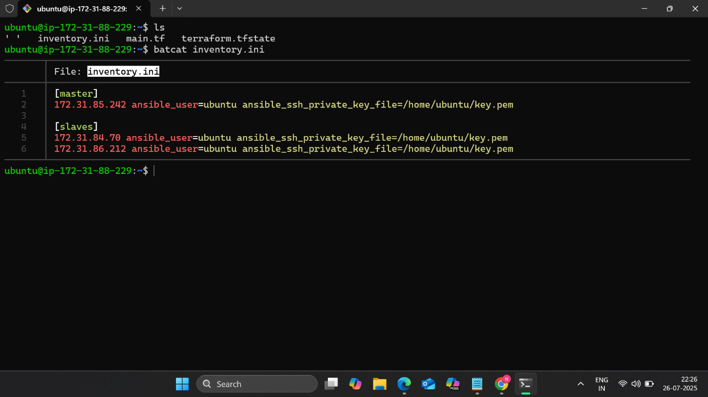
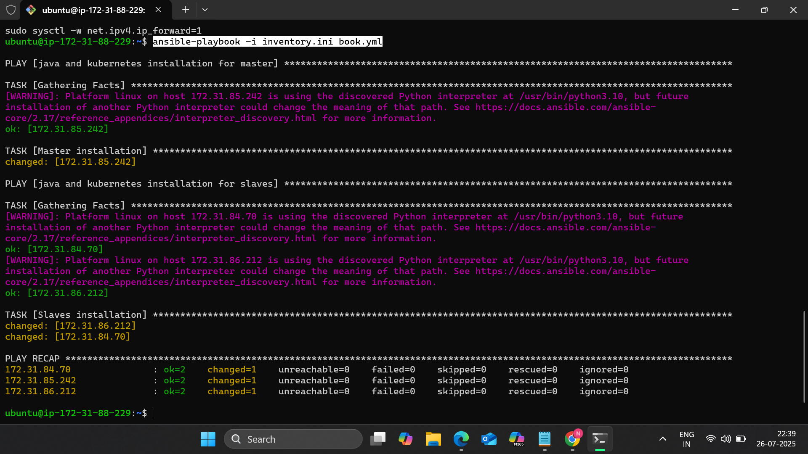

---

# ☸ Kubernetes Cluster Setup

Kubernetes cluster was initialized on the master node:

```bash
kubeadm init --apiserver-advertise-address=<master-private-ip> --pod-network-cidr=10.244.0.0/16
```

Worker nodes joined using the generated join command.

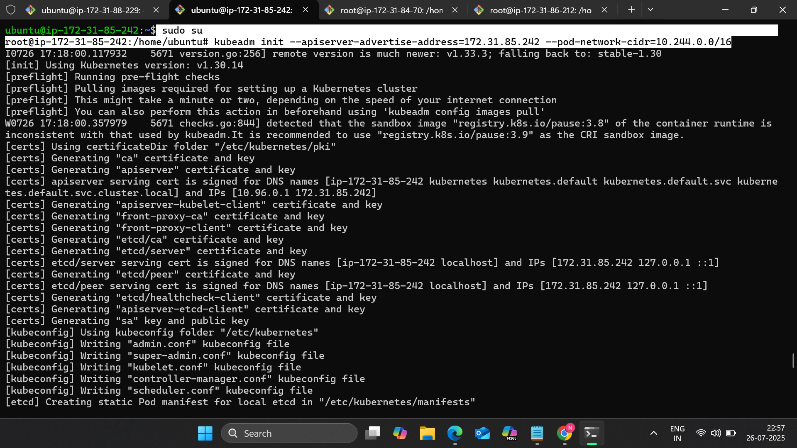
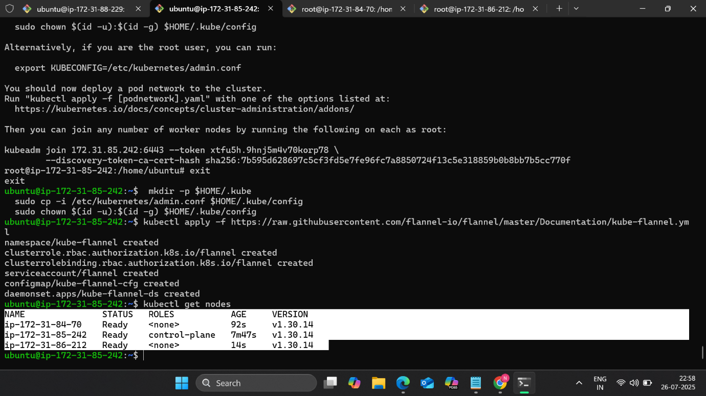

---

# 🐳 Docker Containerization

A custom Dockerfile was created to containerize the application.

Image built and pushed to DockerHub:

```
nishant1784/devops-project2
```

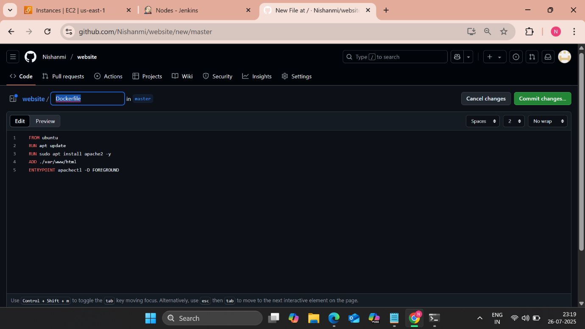
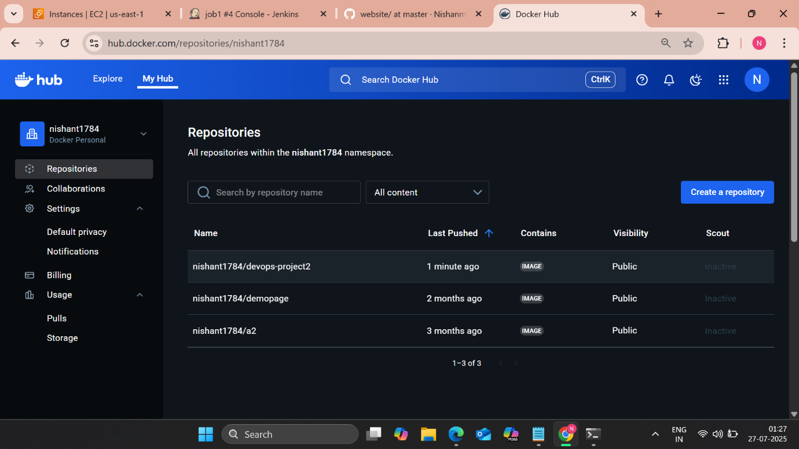

---

# 🔁 Jenkins CI/CD Pipeline

A Jenkins Pipeline was created to automate:

1. Clone GitHub repository  
2. Build Docker image  
3. Push image to DockerHub  
4. Deploy application to Kubernetes cluster  

## Pipeline Stages

- Clone Repository  
- Build Docker Image  
- Push to DockerHub  
- Kubernetes Deployment  

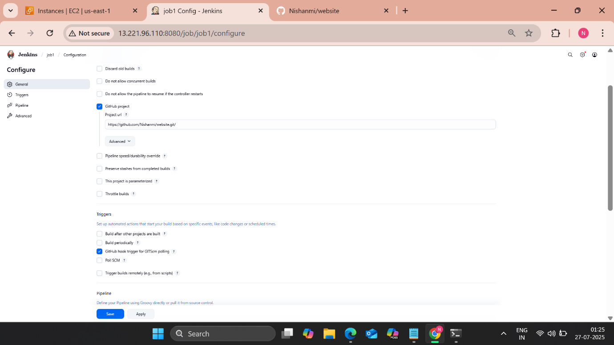
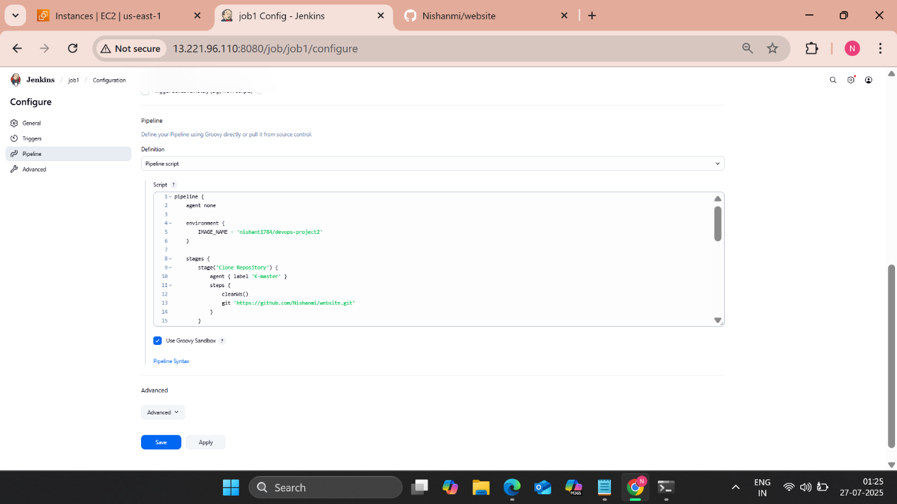
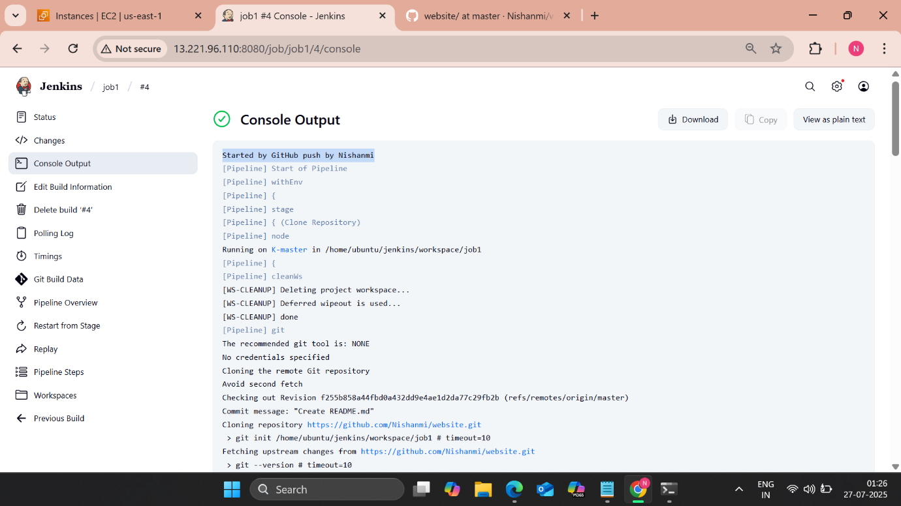

---

# ☸ Kubernetes Deployment

Deployment configuration:

- 2 replicas
- Custom Docker image
- NodePort Service on port 30008

```bash
kubectl apply -f Deploy.yaml
kubectl apply -f Service.yaml
```

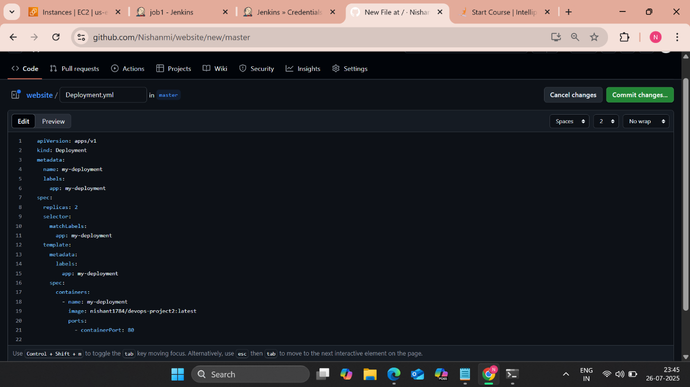
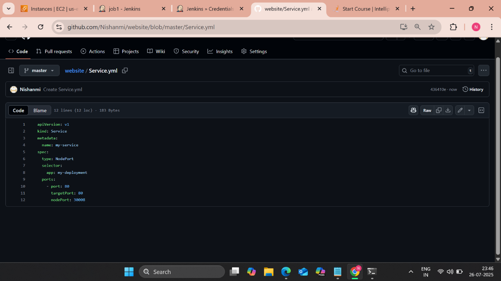

---

# 🌍 Final Application Access

Application exposed via:

```
http://<kube-master-public-ip>:30008
```

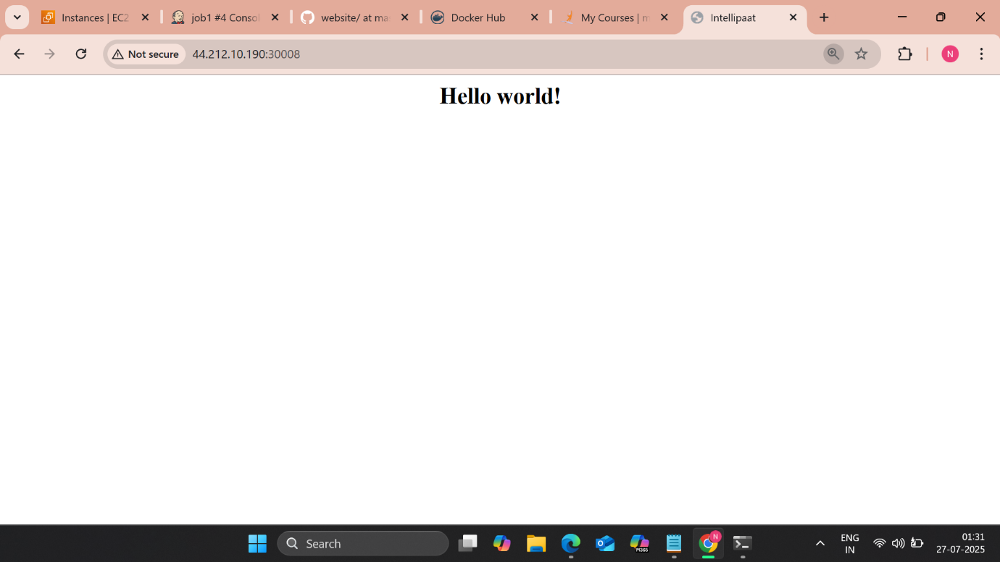

---

# 🔄 Complete DevOps Flow

Terraform  
↓  
EC2 Infrastructure Creation  
↓  
Ansible Configuration  
↓  
Jenkins Pipeline Trigger  
↓  
Docker Build & Push  
↓  
Kubernetes Deployment  
↓  
NodePort Service Exposure  

---

# 🧠 Key Concepts Demonstrated

- Infrastructure as Code (Terraform)
- Configuration Management (Ansible)
- Jenkins CI/CD Pipeline
- Docker Image Build & Push
- Kubernetes Cluster Setup
- Replica Deployment
- NodePort Service Configuration
- Automated Container Orchestration

---

## 👨‍💻 Author

Nishant Mishra  
DevOps & Cloud Enthusiast
