# 🚀 DevOps Lifecycle Implementation – Abode Software

## 📌 Project Overview

As a Sr. DevOps Engineer at Abode Software, I was tasked with implementing a complete DevOps lifecycle for the company’s product hosted on GitHub.

Product Repository:
https://github.com/hshar/website.git

The goal was to automate:

- Infrastructure configuration
- Software provisioning
- Git branching workflow
- CI/CD automation
- Docker containerization
- Environment-based deployment (Test & Production)

---

# 🏗 Infrastructure Architecture

Three EC2 instances were launched:

- **Master Server** – Jenkins + Ansible
- **Test Server**
- **Production Server**

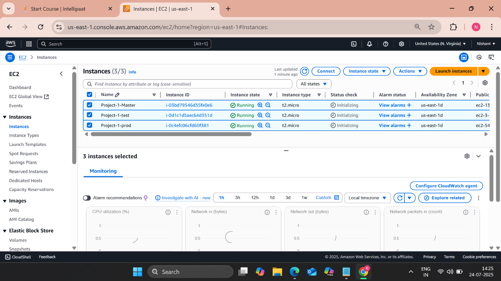

---

# ⚙ Configuration Management – Ansible

Ansible was used to automatically configure Test and Production servers.

## 🔹 Tasks Automated

- Installed Java
- Installed Docker
- Ensured consistent configuration across nodes

## 🔹 Files Included

- `inventory` – Contains Test & Prod server IPs
- `playbook.yml` – Installs required software
- `script.sh` (if applicable)

## 🔹 Execution Command

```bash
ansible-playbook -i inventory playbook.yml
```

## 🔹 Inventory File
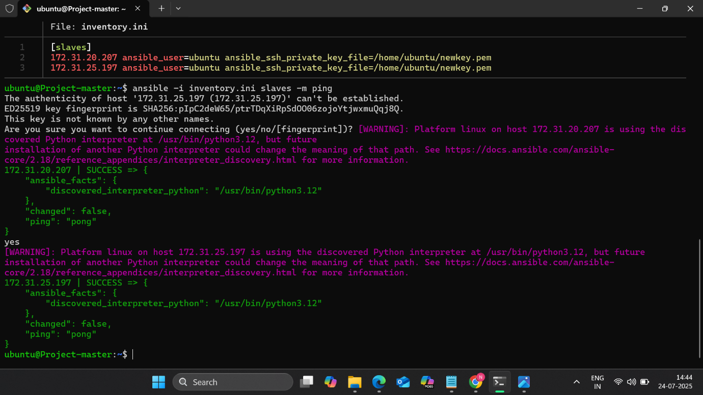

## 🔹 Playbook Execution
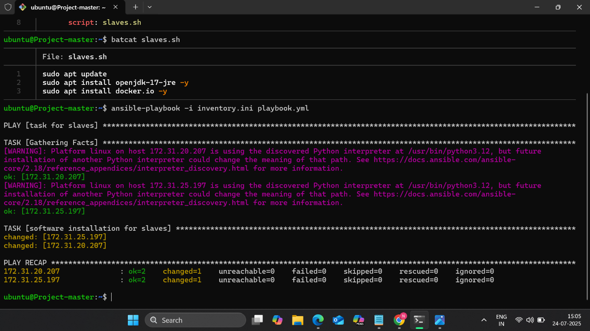

---

# 🧩 Jenkins Master–Agent Setup

- Jenkins installed on Master server
- Test & Prod machines configured as Jenkins nodes
- SSH-based agent communication configured

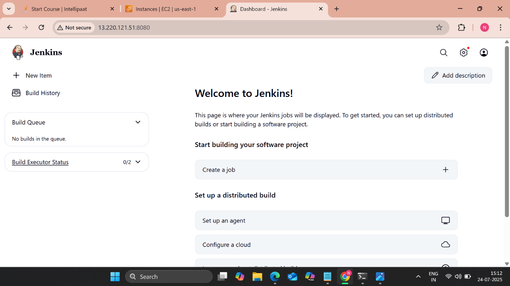
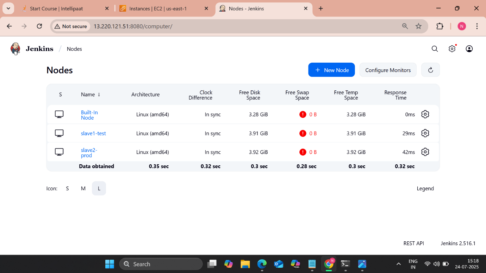

---

# 🌿 Git Workflow Strategy

Branch-based deployment logic implemented:

- `develop` branch → Deploy to **Test**
- `master` branch → Deploy to **Production**

Webhook configured to trigger Jenkins automatically on push.

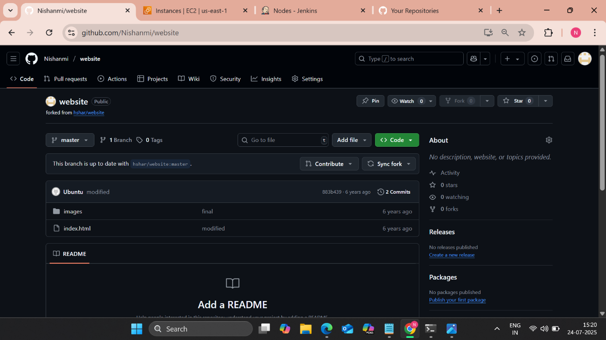
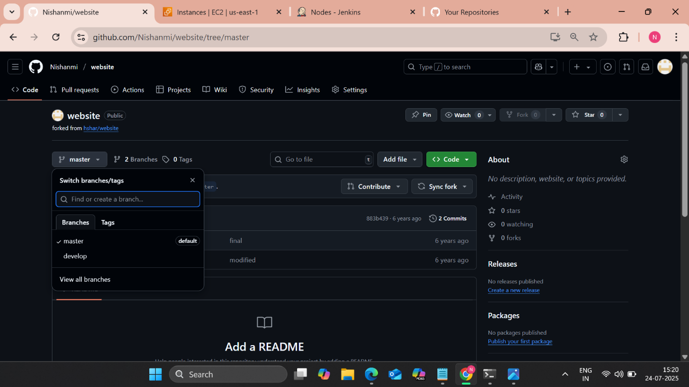
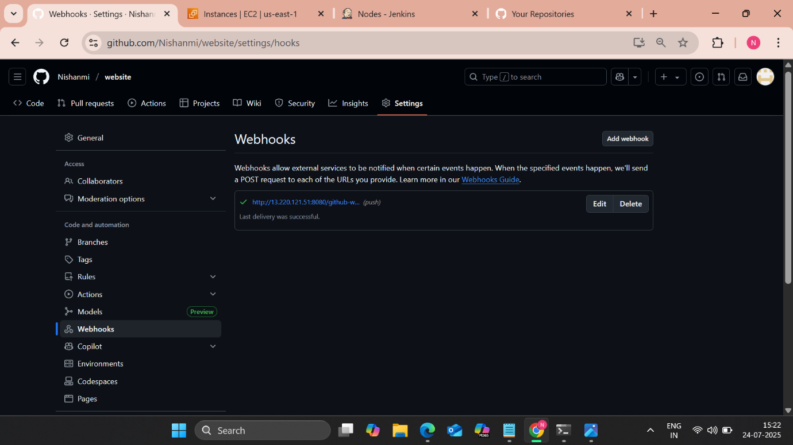

---

# 🐳 Docker Containerization

Application was containerized using a Dockerfile.

Base Image:
```
hshar/webapp
```

Application directory:
```
/var/www/html
```

## 🔹 Docker Commands Used in Pipeline

```bash
sudo docker build . -t img1
sudo docker run -itd --name cont1 -p 81:80 img1
```

---

# 🔁 CI/CD Pipeline Implementation

The DevOps lifecycle was implemented using three Jenkins jobs:

---

## 🔹 Job1 – Build

- Triggered on every commit
- Builds Docker image
- Prepares artifact for deployment

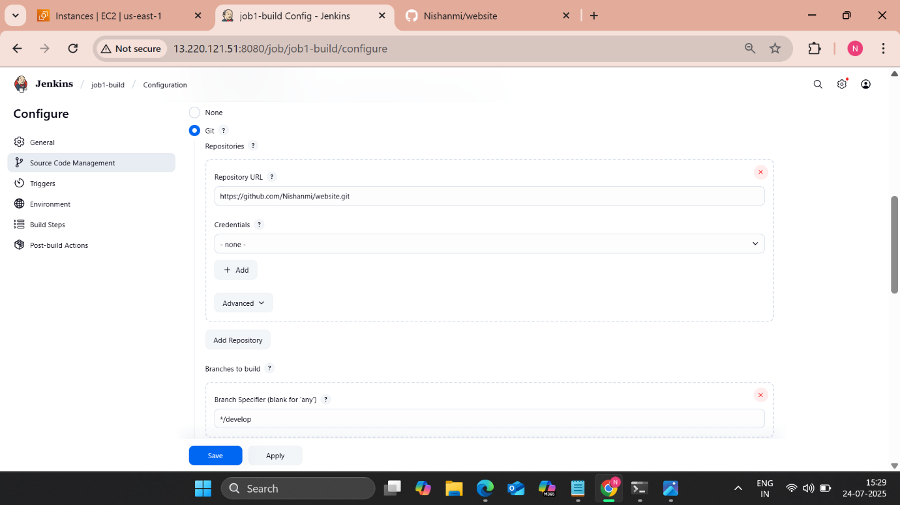

---

## 🔹 Job2 – Test Deployment

- Triggered when commit is pushed to `develop`
- Deploys container on Test server only


---

## 🔹 Job3 – Production Deployment

- Triggered when commit is pushed to `master`
- Deploys container on Production server

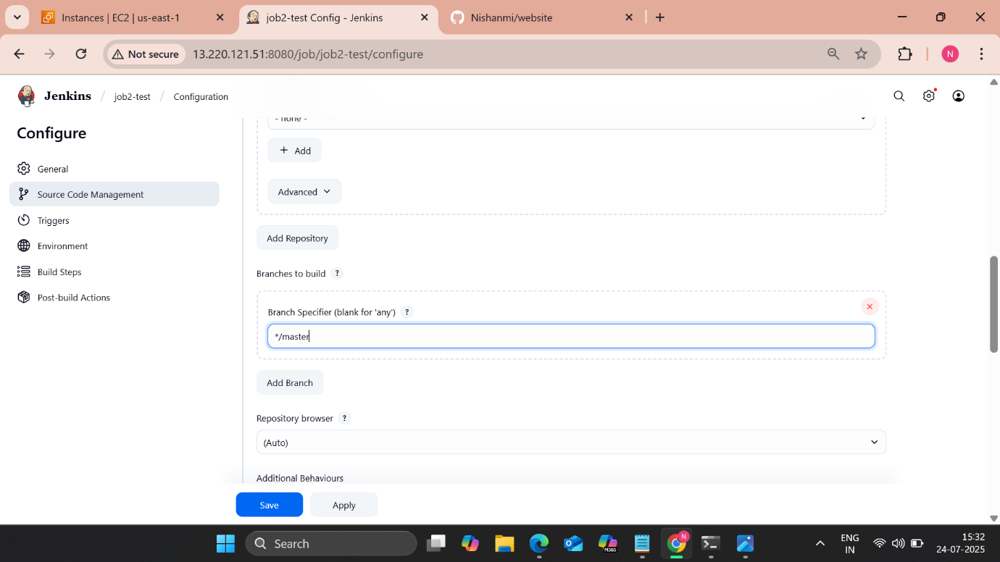

---

# 📊 Build & Deployment Execution

## 🔹 Console Output
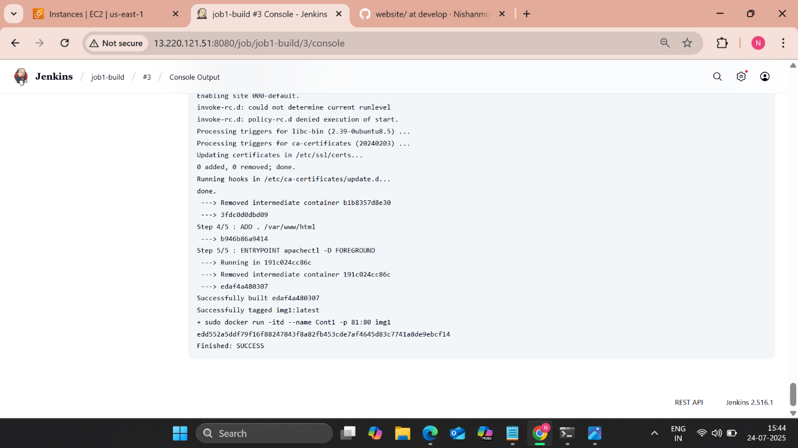

---

# 🌍 Final Deployment Result

Application successfully deployed and accessible via browser from slave server.

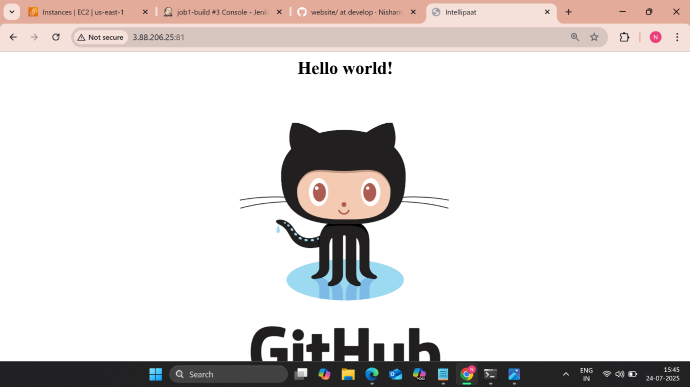

---

# 🔄 DevOps Lifecycle Flow

GitHub Push  
↓  
Webhook  
↓  
Jenkins Pipeline  
↓  
Docker Build  
↓  
Branch-Based Deployment  
↓  
Test or Production Server  

---

# 🧠 Key Concepts Implemented

- Infrastructure Provisioning (EC2)
- Configuration Management (Ansible)
- Jenkins Master-Agent Architecture
- Git Branching Strategy
- Webhook Integration
- CI/CD Automation
- Docker Containerization
- Environment-Based Deployment Logic
- Automated Build & Deployment

---

# 🎯 Outcome

A fully automated DevOps lifecycle was implemented with:

✔ Zero manual deployments  
✔ Branch-based environment control  
✔ Automated testing workflow  
✔ Containerized application delivery  
✔ Infrastructure configuration automation  

---

# 📁 Project Structure

```
abode-devops-lifecycle-project/
├── ansible/
│   ├── inventory
│   ├── playbook.yml
│   └── script.sh
├── Dockerfile
├── screenshots/
└── README.md
```

---
